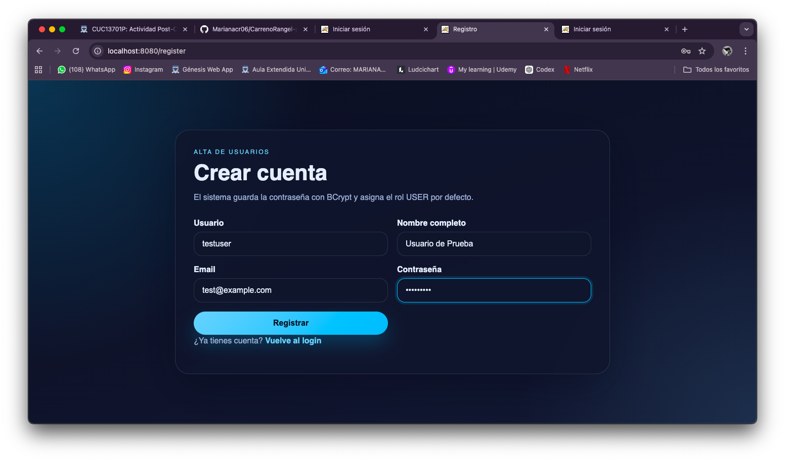
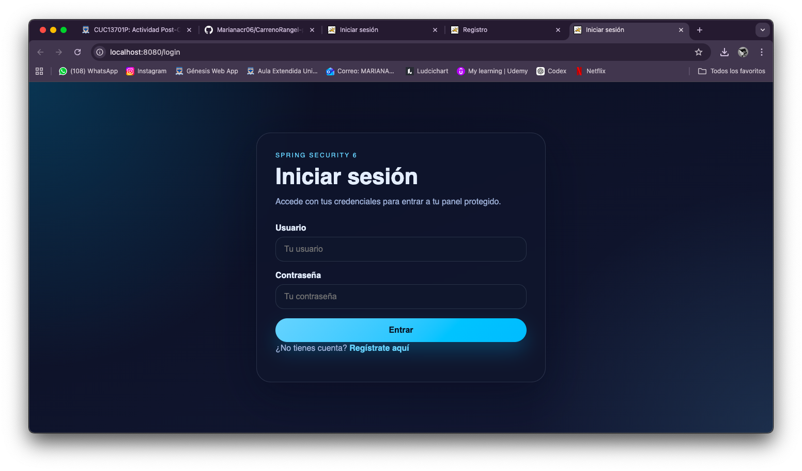
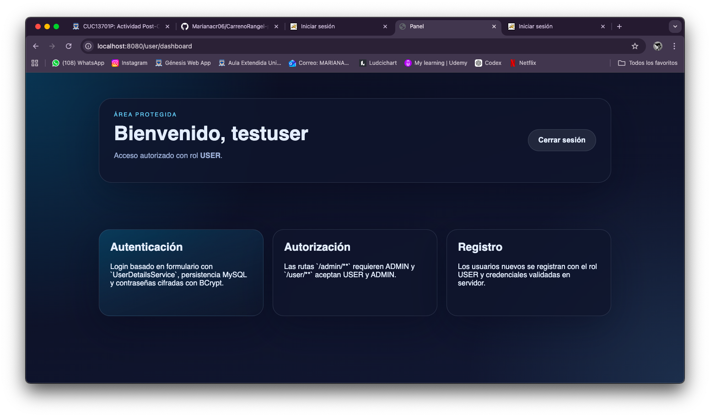
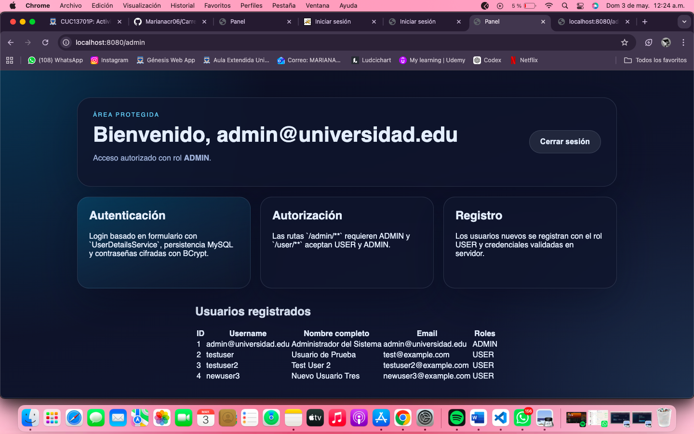
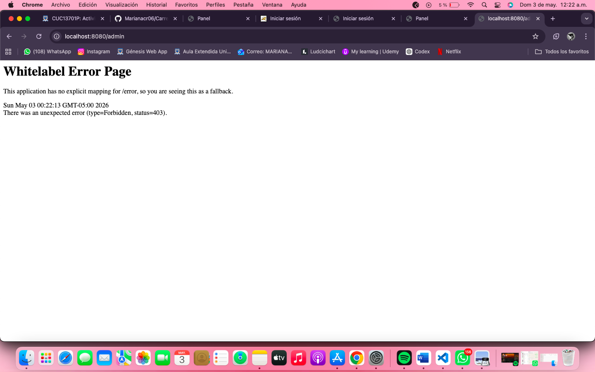

# Auth Demo - Spring Security 6

Proyecto académico de autenticación y autorización con Spring Boot 3 y Spring Security 6.

## Descripción

La aplicación implementa:

- Registro de usuarios con contraseña cifrada con BCrypt.
- Inicio de sesión con formulario.
- Autorización por roles ADMIN y USER.
- Protección de rutas según permisos.
- Vistas con Thymeleaf para flujo completo de autenticación.

## Tecnologías

- Java 17
- Spring Boot 3.3.4
- Spring Security 6
- Spring Data JPA
- Thymeleaf
- H2 Database (en memoria)
- Maven

## Ejecución

```bash
mvn spring-boot:run
```

Aplicación disponible en:

- http://localhost:8080/login

## Rutas principales

- /register: registro público.
- /login: inicio de sesión.
- /dashboard: panel de usuario USER.
- /admin: panel de administrador ADMIN.

## Usuarios de prueba

- ADMIN
	- usuario/email: admin@universidad.edu
	- contraseña: Admin1234!
- USER
	- usuario: testuser
	- contraseña: Test1234!

## Evidencias (capturas)

### 1. Formulario de registro



### 2. Inicio de sesión



### 3. Usuario USER autenticado (panel)



### 4. Usuario ADMIN autenticado y listado de usuarios



### 5. Acceso denegado 403 al entrar a /admin con rol USER



## Validación funcional

- Registro exitoso de nuevos usuarios.
- Redirección tras login según rol.
- Acceso permitido a rutas autorizadas.
- Bloqueo de acceso a /admin para usuarios sin rol ADMIN (403 Forbidden).
